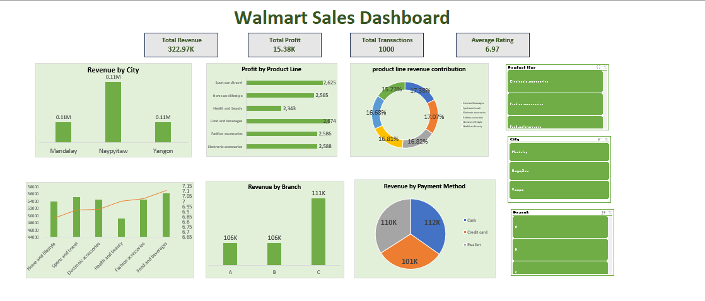

# 🛒 Walmart Sales Analysis Dashboard

## 📌 Project Overview

This project analyzes Walmart sales data using **MySQL** for data analysis and **Microsoft Excel** for dashboard creation. The objective was to answer business questions, uncover meaningful insights, and present them through an interactive dashboard.

---

## 🛠️ Tools & Technologies

- MySQL
- Microsoft Excel
- Pivot Tables
- Pivot Charts
- Slicers
- KPI Cards

---

## 📊 Dashboard Features

- Total Revenue KPI
- Total Profit KPI
- Total Transactions KPI
- Average Customer Rating KPI
- Revenue by City
- Revenue by Branch
- Profit by Product Line
- Revenue by Customer Type
- Revenue by Payment Method
- Revenue Contribution by Product Line
- Revenue & Average Rating by Product Line
- Interactive Slicers

---

## ❓ Business Questions Answered

- Which branch generated the highest revenue?
- Which city contributed the most revenue?
- Which product line generated the highest profit?
- Which payment method was used the most?
- Which customer type generated more revenue?
- Which product line contributed the highest share of total revenue?
- Which product line sold the highest quantity?
- Which product lines generated high revenue but relatively lower customer ratings?

---

## 📈 Key Insights

- Revenue varied across branches and cities.
- Some product lines contributed a significantly larger share of total revenue.
- Member customers generated higher overall revenue than Normal customers.
- Customer ratings helped identify product lines with improvement opportunities.
- Payment method analysis revealed customer purchasing preferences.

---

## 📂 Project Files

- `WalmartSalesData.csv`
- `Walmart Dashboard.xlsx`
- `Walmart_SQL_Queries.sql`
- `Walmart_dashboard.png`

---

## 📷 Dashboard Preview

---

## 🎯 Skills Demonstrated

- SQL Query Writing
- Data Analysis
- Business Intelligence
- Data Visualization
- Excel Dashboard Development
- KPI Design
- Interactive Reporting

---
⭐ If you found this project interesting, feel free to explore the repository!
